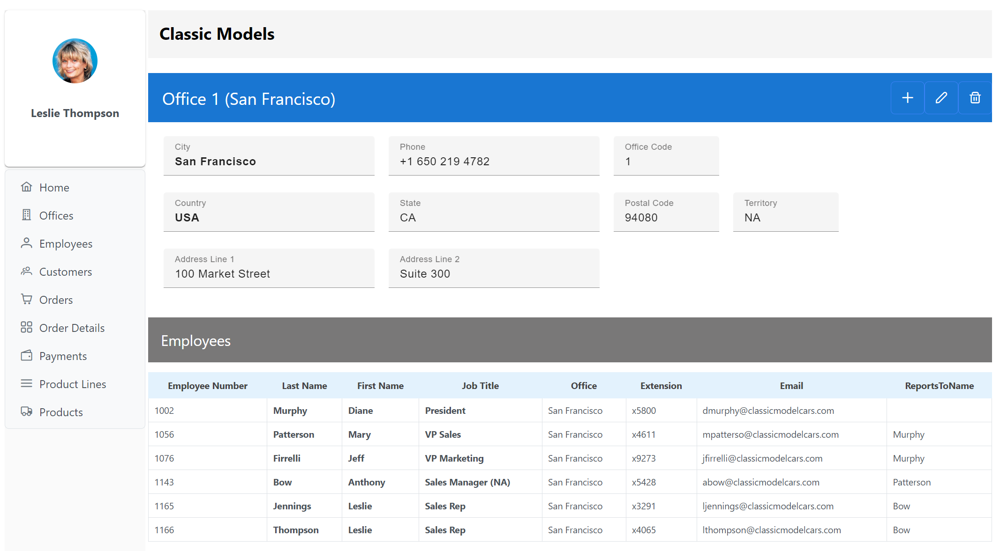

# classic_models_frontend_angular

## What it is
This is a simple frontend for the [MySQL Sample Database](https://www.mysqltutorial.org/mysql-sample-database.aspx).

It depends on my Webservice backend "classic_models_backend_spring".

### Tooling
"classic_models_frontend_angular" is a SPA (Single page application), using Angular.

This frontend uses:
* [Angular 18](https://angular.io/)
* [PrimeNG](https://primeng.org/), an Angular component library 
* [Angular router](https://angular.io/guide/router)
* [node.js and npm](https://docs.npmjs.com/downloading-and-installing-node-js-and-npm)
* Typyescript (as programming language)
  
## How to install
* "classic_models_frontend_angular" depends on its backend "classic_models_backend_spring" and MySQL, so you should install and run them first.
* [Download and install node.js and npm](https://docs.npmjs.com/downloading-and-installing-node-js-and-npm)
* [Install Angular](https://angular.io/guide/setup-local) with "npm install -g @angular/cli"
* You may find the [Vue CLI](https://cli.vuejs.org/) useful.
* Clone this repository ("classic_models_frontend_angular")
* Open a terminal
* Switch into the project directory
* Run "npm install"

## How to run
* Run the backend "classic_models_backend_spring" first. This will use Port 8080.
* Run "classic_models_frontend_angular". This will use Port 4200, and expect the backend at Port 8080.
* For development: run "npm start"

## Todos
* Insert, Update, Delete is only implemented for Offices.
* Recursive Navigation in Employees doesn't refresh details correctly.
* Clean up code and HTML

## Pictures

